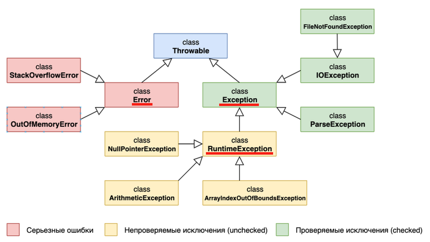

# Язык Java

## Осенний семестр 2023, бакалавриат, 3 курс

### Лекция 4: Обработка ошибок и исключений

---

## Содержание

1. Классификация исключений
2. Примеры исключений из стандартной библиотеки Java
3. Генерация исключений
4. Перехват исключений


---

## Исключения

- **Исключение** - возникновение ошибок и непредвиденных ситуаций при выполнении программы, делающих дальнейшие вычисления невозможными или бессмысленными

- Причины исключений:
  - Ошибки программирования
  - Неверные действия пользователя
  - Нехватка вычислительных ресурсов, доступных программе
  - Сетевые ошибки
  - ...

---

## Классификация исключений



---

## Примеры серьезных ошибок

- Переполнение стека из-за бесконечной рекурсии (`StackOverflowError`)

    ```java
    long calculateFactorial(int number) {
        return number * calculateFactorial(number - 1);
    }
    ```

- Превышение лимита на динамическую память (`OutOfMemoryError`)

    ```java
    int[] createLongArray() {
        return new int[Integer.MAX_VALUE];
    }
    ```

---

## Примеры непроверяемых исключений (unchecked)

- Исключение нулевого указателя (`NullPointerException`)

    ```java
    String name = null;
    int length = name.length();
    ```

- Арифметическое исключение (`ArithmeticException`)

    ```java
    int value = 1 / 0;
    ```

- Выход за границы массива (`ArrayIndexOutOfBoundsException`)

    ```java
    int[] array = {1, 2, 3};
    int value = array[100];
    ```

---

## Примеры непроверяемых исключений (unchecked)

- Выход за границы строки (`StringIndexOutOfBoundException`)

    ```java
    String greeting = "Привет!";
    char symbol = greeting.charAt(100);
    ```

- Исключение при явном приведении типов (`ClassCastException`)

    ```java
    Object greeting = "Привет!";
    Integer greetingAsInt = (Integer)greeting;
    ```

---

## Примеры проверяемых исключений (checked)

- Исключение при отсутствии файла по заданному пути (`FileNotFoundException`)

    ```java
    Scanner scanner = new Scanner(new File("/"));
    ```

    Ошибка компиляции: `Unhandled exception: java.io.FileNotFoundException`

- Исключение при преобразовании строки в дату (`ParseException`)

    ```java
    new SimpleDateFormat().parse("32.01.2023");
    ```

    Ошибка компиляции: `Unhandled exception: java.text.ParseException`

---

## Упражнение

Какие исключения могут возникнуть при выполнении следующего метода?

```java
// Вычисление среднего значения первых k чисел массива array
double getAverage(Integer[] array, int k) {
    int sum = 0;
    for (int i = 0; i < k; i++) {
        sum += array[i];
    }
    return (double)sum / array.length;
}
```

---

## Генерация исключений

```java
int factorial(int number) {
    if (number < 0) {
        throw new RuntimeException("Факториал отрицательного числа!");
    }

    if (number == 0) {
        return 1;
    }

    return number * factorial(number - 1);
}
```

---

## Обработка исключений

```java
String readStringFromFile() {
    Scanner scanner = new Scanner(new File("/")); // ошибка компиляции: "Unhandled exception ...."
    return scanner.next();
}
```

- **Вариант 1**: делегирование обработки исключения потребителю метода

    ```java
    String readStringFromFile() throws FileNotFoundException {
        Scanner scanner = new Scanner(new File("/"));                                            
        return scanner.next();
    }
    ```

- **Вариант 2**: перехват исключения (try-catch) и самостоятельная обработка

    ```java
    String readStringFromFile() {
        try {
            Scanner scanner = new Scanner(new File("/"));                                          
            return scanner.next();
        } catch (FileNotFoundException e) {
            e.printtStackTrace();  // печать информации об исключении в консоль
            return "";
        }
    }
    ```

---

## Обработка исключений

- **Вариант 3**: Подмена исключения

    ```java
    String readStringFromFile() {
        try {
            Scanner scanner = new Scanner(new File("/"));
            return scanner.next();
        } catch (FileNotFoundException e) {
            throw new RuntimeException("Ошибка при чтении строки из файла", e);
        }
    }
    ```

---

## Упражениние

Корректен ли следующий метод?

```java
int getValue() throws NullPointerException {
    return 0;
}
```

---

## Упражнение

```java
int compute() throws ArithmeticException {
    return 1 / 0;                                                                            
}
```

Какие из следуюших методов  содержат ошибки компиляции?

```java
int getValue1() {
    return compute();                                                                          
}
```

```java
int getValue2() throws NullPointerException {
    return compute();                                                                          
}
```

```java
int getValue3() {
    try {
        return value();
    } catch (ArithmeticException e) {                                                           
        e.printStackTrace();
    }
}
```

---

## Перехват нескольких исключений

```java
int getDivisionRest(Integer a, Integer b) {
    try {
        return a % b;
    } catch (NullPointerException e) {
        // ...
    } catch (ArithmeticException e) {
        // ...
    }
}
```

**Вопрос**: Какое из исключений будет обработано при следующем вызове:

```java
getDivisionRest(null, 0);
```

---

## `try-catch-finally`

`finally`пределяет общий код, который должен быть запущен как после `try`,  так и после `catch` блока (например, для освобождения ресурсов)

```java
Integer findQuotient() throws FileNotFoundException {
    Scanner scanner = new Scanner(new File("file.txt"));
    try {
        int a = scanner.nextInt();
        int b = scanner.nextInt();
        return a / b;
    } catch (ArithmeticException | NoSuchElementException e) {
        e.printStackTrace();
        return null;
    } finally {
        scanner.close();
    }
}
```

---

## `try-finally`

Блок `catch` можно опустить, если обработка исключения делегируется потребителю метода

```java
Integer findQuotient() throws FileNotFoundException {
    Scanner scanner = new Scanner(new File("file.txt"));
    try {
        int a = scanner.nextInt();
        int b = scanner.nextInt();
        return a / b;
    } finally {
        scanner.close();
    }
}
```

Независимо от того, будет ли в блоке `try` сгенерировано исключение или нет, инструкция `scanner.close()` будет выполнена.

---

## `try` с ресурсами

```java
Integer findQuotient() throws FileNotFoundException {
    try (Scanner scanner = new Scanner(new File("file.txt"))) {                                      
        int a = scanner.nextInt();
        int b = scanner.nextInt();
        return a / b;
    }
}
```

`Scanner` реализует интерфейс `AutoCloseable` (с методом `close`)

Эквивалентный код:

```java
Integer findQuotient() throws FileNotFoundException {                                                 
    Scanner scanner = new Scanner(new File("file.txt"));                                
    try {
        int a = scanner.nextInt();
        int b = scanner.nextInt();
        return a / b;
    } finally {
        scanner.close();
    }
}
```

---

## Создание собственного исключения

```java
// исключение при неуспешном подключении к базе данных
class DatabaseClientException extends Exception {} // проверяемое исключение
```

```java
// клиент для подключения к базе данных
class DatabaseClient {
    // строка для подключения к базе данных
    private String connectionString;

    DatabaseClient(String connectionString) throws DatabaseClientException {
        if (connectionString == null) {
            throw new DatabaseClientException();
        }
        this.connectionString = connectionString;
    }
}
```

**Вопрос**: Как создать непроверяемое исключение?

---

## Упражнение

```java
class A extends Exception {}
```

```java
class B extends A {}
```

Что будет выведено в консоль после выполнения следующего кода?

```java
try {
    throw new B();
} catch (A a) {
    System.out.println("A");
} catch (B b) {
    System.out.println("B");
}
```

---

## Упражнение

```java
class A extends Exception {}
```

```java
class B extends A {}
```

А что произойдет в таком случае?

```java
try {
    throw new B();
} catch (B b) {
    System.out.println("B");
} catch (A a) {
    System.out.println("A");
}
```
