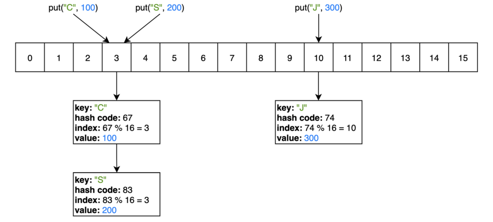

# Язык Java

## Осенний семестр 2023, бакалавриат, 3 курс

### Лекция 5: Шаблоны, коллекции, Stream API

---

## Содержание

1. Шаблоны (Generics)
2. Функциональные интерфейсы и лямбда-выражения
3. Коллекции
4. Stream API

---

## Шаблоны (Generics)

- Шаблоны - это параметризованные типы данных
- Мотивация: сократить повторение кода

<div class="columns">
<div>

```java
// Класс-контейнер для массива типа Integer[]
class IntegerArrayContainer {
    Integer[] array;

    IntegerArrayContainer(Integer[] array) {
        this.array = array;
    }

    void print() {
        for (Integer element : array) {
            System.out.println(element);
        }
    }
}
```

</div>
<div>

```java
// Класс-контейнер для массива типа String[] 
class StringArrayContainer {
    String[] array;

    StringArrayContainer(String[] array) {
        this.array = array;
    }

    void print() {
        for (String element : array) {
            System.out.println(element);
        }
    }
}
```

</div>
</div>

- Вместо классов `IntegerArrayContainer` и `StringArrayContainer` можно создать один шаблонный класс `ArrayContainer<T>`, где `T` - это переменная типа, которая может принимать значения `Integer`, `String`, ...

---

## Шаблонные классы

- Определение шаблонного класса

    ```java
    class ArrayContainer<T> {
        T[] array;                                                                                                         

        ArrayContainer(T[] array) {
            this.array = array;
        }

        void print() {
            for (T element : array) {
                System.out.println(element);
            }
        }
    }
    ```

- Использование шаблонного класса

    ```java
    ArrayContainer<Integer> integerArrayContainer = new ArrayContainer<>(new Integer[]{1,2,3});          
    ArrayContainer<String>  stringArrayContainer  = new ArrayContainer<>(new String[]{"a","b"});
    // То же самое, что ArrayContainer<Object>:
    ArrayContainer objectArrayContainer = new ArrayContainer(new Object[]{1, "a"});
    ```

- **Внимание**: тип параметра <u>не может быть</u> примитивным (`int`, `double`, ...)

---

## Шаблонные классы с несколькими параметрами

```java
// класс-контейнер для хранения пары элементов разных типов
class Pair<T, U> {
    T firstElement;
    T secondElement;

    Pair(T firstElement, U secondElement) {
        this.firstElement = firstElement;
        this.secondElement = secondElement;
    }
}
```

```java
Pair <String, Integer> pair = new Pair<>("key", 1);

// То же самое, что Pair<Object, Object>:
Pair objectPair = new Pair(new Object(), new Object());
```

---

## Функциональные интерфейсы

- Мотивация: использование функции $f: T \to R$ как переменной
- **Функциональный интерфейс** - интерфейс `Function<T,R>`
- Примеры:

    ```java
    class SquareRoot {
        static Double squareRootStatic(Integer number) { return Math.sqrt(number); }                  
        Double squareRoot(Integer number) { return Math.sqrt(number); }

        void examples() {
            // определение функциональной переменной f: Integer -> Double
            Function<Integer, Double> f;

            // присваивание значения функциональной переменной
            f = SquareRoot::squareRootStatic; // ссылка на статический метод
            f = this::squareRoot;             // ссылка на метод объекта
            f = x -> Math.sqrt(x);            // лямбда-выражение

            // вычисление значения функции
            Double value = f.apply(4); // 2.0
        }
    }
    ```

---

## Лямбда-выражения

- Функции одной переменной

    ```java
    Function<Integer, Double> f;
    f = x -> Math.sqrt(x);
    f = x -> {
        System.out.println(x);
        return Math.sqrt(x);
    };
    ```

- Функции двух переменных

    ```java
    // g: Integer x Integer -> Boolean
    BiFunction<Integer, Integer, Boolean> g;
    g = (x, y) -> x.equals(y);
    g = (Integer x, Integer y) -> {
        System.out.println(x + ", " + y);
        return x.equals(y);
    };
    ```

---

## Пользовательские функциональные интерфейсы

Функциональный интерфейс для функции с произвольным набором аргументов

```java
@FunctionalInterface
interface BinaryOperator {
    Integer func(Integer x, Integer y);
}
```

Пример использования

```java
BinaryOperator sum = (x, y) -> x + y;
Integer result = sum.func(1, 2); // 3
```

---

## Коллекции `java.util`


---

## Maps (словари) `java.util`


---

## Интерфейс `Collection<T>`

```java
interface Collection<T> {
    // "мутации"
    boolean add(T t);         // добавить элемент в коллекцию
    boolean remove(Object o); // удалить элемент из коллекции
    void clear();             // удалить все элементы из коллекции

     // "запросы"
    boolean contains(Object o); // проверка наличия элемента в коллекции
    int size();                 // количество элементов в коллекции
    boolean isEmpty();          // проверка пустоты

    Iterator<T> iterator();     // порядок обхода элементов коллекции

    // ...
}
```

---

## Интерфейс `List<T>`

- Линейный список
- Каждый элемент списка имеет индекс (как массив)

```java
interface List<T> extends Collection<T> {
    // "мутации"
    T set(int index, T element);    // изменить элемент с индексом index
    void add(int index, T element); // добавить новый элемент на позиции index
    T remove(int index);            // удалить элемент с индексом index

    // "запросы"
    T get(int index);               // значение элемента с индексом index
    int indexOf(Object o);          // индекс первого появления o в списке
    int lastIndexOf(Object o);      // индекс последнего появления o в списке

    // ...
}
```

- **Внимание**: Интерфейс `List` включает в себя все методы интерфейса `Collection`

---

## Класс `ArrayList<T>`

- Реализация списка с помощью массива (используется буфер типа `Object[]`)
- Динамическое увеличение размера буфера при переполнении:
  - создается новый буфер вдвое большего размера
  - происходит копирование элементов из старого буфера в новый

---

## Инициализация списков

- с помощью метода `add`:

    ```java
    List<Integer> list = new ArrayList<>();                                                        
    list.add(1);
    list.add(2);
    ```

- с помощью метода `List.of`:

  - перечислением элементов:

    ```java
    List<Integer> list = List.of(1, 2, 3);                                                         
    ```

  - из массива элементов

    ```java
    Integer[] array = { 1, 2, 3 }
    List<Integer> list = List.of(array);                                                           
    ```

  **Внимание**: `List.of` создает неизменяемый список (нельзя добавлять, изменять и удалять элементы списка)

---

## Примеры работы со списками

```java
// инициализация списка
List<String> list = new ArrayList<>(); // создание пустого списка

// добавление элементов
list.add("A");    // list = ["A"]
list.add("B");    // list = ["A", "B"]
list.add(1, "C"); // list = ["A", "C", "B"]

// запросы
String first = list.get(0);       // "A"
int indexOfA = list.indexOf("A"); // 0
int size = list.size();           // 3

// обход элементов
for (String item : list) {
    System.out.print(item);  // ACB
}

// удаление элементов
list.remove("C"); // list = ["A", "B"]
list.remove(0);   // list = ["B"]
```

---

## Интерфейс `Map<K,V>`

```java
interface Map<K,V> {
    // "мутации"
    V put(K key, V value); // добавление элемента с ключом key и значением value
    V remove(Object key);  // удаление элемента с ключом key
    void clear();          // удаление всех элементов

    // "запросы"
    V get(Object key); // значение элемента с ключом key
    boolean containsKey(Object key); // проверка, содержит ли словарь элемент с ключом key
    boolean containsValue(Object value); // проверка, содержит ли словарь элемент со значением value
    int size(); // размер
    boolean isEmpty(); // проверка пустоты

    // коллекции
    Set<K> keySet(); // множество ключей
    Collection<V> values(); // коллекция значений
}
```

---

## Класс `HashMap<K,V>`

- Реализация в виде хеш-таблицы (массива связных списков)
  - для ключа `key` вычисляется хеш: `int hash = key.hashCode()`
  - индекс массива вычисляется как `hash % arrayLength`
- Пример: `HashMap<String, Integer>`
  

---

## Примеры со словарями

```java
// инициализация словаря
Map<String, Integer> map = new HashMap<>();

// добавление элементов
map.put("C", 100); // {"C": 100}
map.put("B", 200); // {"C": 100, "B": 200}
map.put("A", 300); // {"C": 100, "B": 200, "A": 300}
map.put("C", 400); // {"C": 400, "B": 200, "A": 300}

int size = map.size(); // 3
int valueOfC = map.get("C"); // 400

// метод forEach с лямбда-выражением
map.forEach((key, value) -> System.out.print(key + ":" + value + " "));
// A:300 B:200 C:400 (не в порядке добавления!)
```

---

## Класс `Optional<T>`

- Мотивация: попытка предотвратить `NullPointerException`

    ```java
    Student student = getStudentById(123); // может быть null
    String name = student.getName(); // может быть сгенерировано NullPointerException
    ```

- `Optional<T>` - класс контейнер, содержащий **максимум** одно значение типа `T`, не равное `null`

- `Optional<Student> studentOptional = findStudentById(123);
`
  - Если `studentOptional` содержит значение:

    ```java
    boolean isPresent = studentOptional.isPresent(); // true
    Student student = studentOptional.get(); // значение, хранящееся в studentOptional
    ```

  - Если `studentOptional` **не** содержит значение:

    ```java
    boolean isEmpty = studentOptional.isEmpty(); // true
    Student student = studentOptional.get(); // NoSuchElementException                       
    ```

---

## `Optional<T>`: пример

Поиск индекса элемента в строке

```java
Optional<Integer> getIndexOf(List<String> list, String searchElement) {
    int index = list.indexOf(searchElement);
    if (index == -1) { // элемент не найден в списке
        return Optional.empty();
    }
    return Optional.of(index);
}
```

```java
List<String> list = List.of("A", "B");
Optional<Integer> foundIndex = getIndexOf("A"); // foundIndex.get() равно 0
```

---

## Java Stream API

- Stream API - библиотека для обработки последовательностей элементов (стримов)
- Интерфейс для стримов: `Stream<T>` из пакета `java.util.stream`

    

---

## Пример 1

Преобразование списка типа `List<Integer>` (например, `[1, 2, 3]`) в список типа `List<String>` (например, `["1", "2", "3"]`)

```java
List<Integer> inputList = List.of(1, 2, 3); // источник данных

Stream<Integer> stream1 = inputList.stream(); // создание стрима
Stream<String> stream2 = stream1.map(e -> e + ""); // промежуточная операция

List<String> outputList = stream2.toList(); // терминальная операция
```

Обычно используется более короткая запись:

```java
    List<String> outputList = List.of(1, 2, 3).stream()
        .map(e -> e + "")
        .toList();
```

---

## Пример 2

Удаление четных чисел из списка типа `List<Integer>` (например, преобразование `[1, 2, 3, 4]` в `[1, 3]`)

```java
List<Integer> outputList = List.of(1, 2, 3, 4).stream()
    .filter(e -> e % 2 !== 0)
    .toList();
```

---

## Создание стрима

- Перечислением элементов:

    ```java
    Stream<Integer> stream = Stream.of(1, 2, 3);                                                   
    ```

- Из массива:

    ```java
    Integer[] array = [1, 2, 3];
    Stream<Integer> stream = Stream.of(array);                                                     
    ```

- Из коллекции (`Collection<T>`)

    ```java
    Collection<Integer> collection = List.of(1, 2, 3);                                             
    Stream<Integer> stream = collection.stream();
    ```

- Генерацией элементов (например, бесконечной случайной последовательности чисел)

    ```java
    Random random = new Random(); // генератор случайных чисел
    Stream<Integer> stream = Stream.generate(() -> random.nextInt());                              
    ```

---

## Промежуточные операции над стримами

- `map`
- `filter`
- `flatMap` (преобразование нескольких стримов в один)

    ```java
    // Пример: преобразование матрицы в одномерный массив
    Integer[][] matrix = {{1, 2, 3}, {4, 5, 6}};

    Integer[] array = Arrays.stream(matrix) // создание Stream<Integer[]>
        .flatMap(row -> Arrays.stream(row)) // слияние стримов строк в общий стрим Stream<Integer>
        .toArray(Integer[]::new);           // терминальная операция: преобразование Stream<Integer> в Integer[]
    ```

- `skip`

    ```java
    // пропуск первых трех элементов стрима
    Stream<Integer> stream = Stream.of(1, 2, 3, 4, 5, 6).skip(3); // стрим 4, 5, 6                              
    ```

- `limit`

    ```java
    // ограничение стрима до трех первых элементов
    Stream<Integer> stream = Stream.of(1, 2, 3, 4, 5, 6).limit(3); // стрим 1, 2, 3                              
    ```

---

## Промежуточные операции надо стримами

- `distinct` (удаление повторяющихся элементов из стрима)

    ```java
    Stream<Integer> stream = Stream.of(1, 2, 1, 2, 2, 3).distinct(); // стрим 1, 2, 3
    ```

- `sorted` (сортировка элементов)

    ```java
    // сортировка по возрастанию
    Stream<Integer> sorted = stream.of(4, 1, 2, 6, 5, 3).sorted(); // стрим 1, 2, 3, 4, 5, 6
    ```

     ```java
    // сортировка по убыванию
    Stream<Integer> sorted = stream.of(4, 1, 2, 6, 5, 3).sorted(Comparator.reverseOrder());
    // стрим 6, 5, 4, 3, 2, 1
    ```

--- 

## Конечные операции над стримами

- `collect`
  
  - преобразование в список

    ```java
    Stream<Integer> stream = Stream.of(1, 2, 3);

    List<Integer> list = stream.collect(Collectors.toList());
    // использование конкретной реализации интерфейса List<...>
    ArrayList<Integer> arrayList = stream.collect(Collectors.toCollection(ArrayList::new));
    ```

  - преобразование в словарь

    ```java
    Stream<Integer> stream = Stream.of(1, 2, 3);

    Map<String, Integer> map = stream.collect(Collectors.toMap(                          
        e -> String.valueOf(e), // ключ
        e -> e                  // значение
    )); // {"1": 1, "2": 2, "3": 3}
    ```

---

## Конечные операции над стримами

- `toArray` (преобразование стрима в массив)

    ```java
    Stream<Integer> stream = Stream.of(1, 2, 3);                                                   
    Integer[] array = stream.toArray(Integer[]::new);
    ```

- `findFirst` (получение первого элемента стрима)

    ```java
    Stream<Integer> stream = Stream.of(1, 2, 3);                                                   
    Optional<Integer> first = stream.findFirst(); // Optional.of(1)
    ```

- `forEach`

    ```java
    Random random = new Random(); 
    Stream<Integer> stream = Stream.generate(() -> random.nextInt());

    // бесконечный цикл, выводящий в консоль случайные числа
    stream.forEach(number -> System.out.println(number)); // или короче: stream.forEach(System.out::println)
    ```
