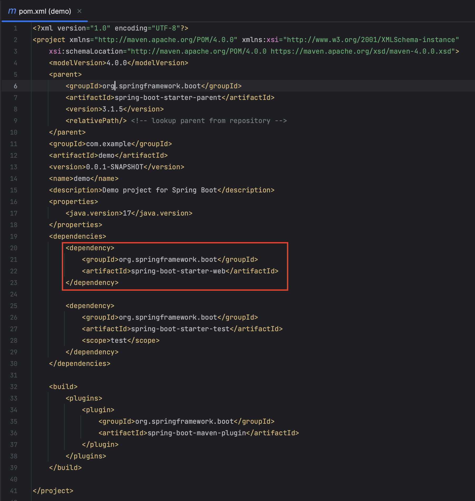
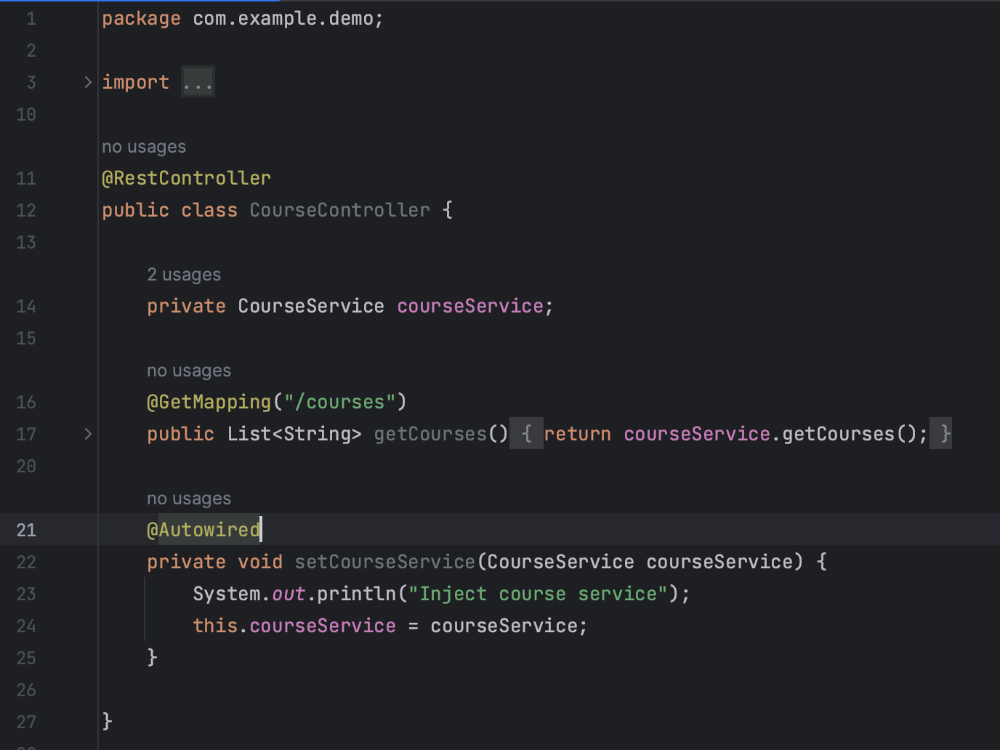

# Язык Java

## Осенний семестр 2023, бакалавриат, 3 курс

### Лекция 6: Spring Boot

---

## Содержание

1. Фреймворк Spring и его основные компоненты
2. Spring Boot
3. Создание проектов Spring с помощью Spring Initializr
4. Проект "Hello, World!" на Spring
5. IoC-контейнер Spring

---

## Spring

- Универсальный фреймворк (каркас) для создания современных корпоративных приложений
- Бесплатный фреймворк с открытым кодом
  - Ссылка на гитхаб: <https://github.com/spring-projects/spring-framework>
- Официальная страница проекта: <https://spring.io/projects/spring-framework>

---

## Основные компоненты фреймворка Spring

- **IoC-контейнер** (IoC - инверсия управления)

- **Spring MVC** (создание веб-приложений)

- **Spring Data** (работа с базами данных)

- **Spring Security** (управление аутентификацией и авторизацией)

- **Spring Test** (создание юнит- и интеграционных тестов)

---

## Spring Boot

- Расширение фреймворка Spring
- Упрощает создание приложений за счет уменьшения затрат на конфигурование и написание шаблонного кода для инициализации приложения
- Главные фичи:
  - "Стартеры" (Maven-зависимости) для простоты управления зависимостями
  - Встроенный веб-сервер (Apache Tomcat по умолчанию)
  - Автоматическая конфигурация

---

## Spring Initializr

Ссылка: <https://start.spring.io/>


---

## Демо-проект Spring Boot: pom.xml



---

## Демо-проект Spring Boot: метод main


---

## Пример: REST-контроллер


---

## Пример: сервис

<div class="columns">
<div>


</div>
<div>


</div>
</div>

**Вопрос**: какие недостатки есть у такой реализации?

---

## IoC-контейнер

**Инверсия управления** (inversion of control) - делегирование фреймворку (контейнеру) управления (в частности, создания) объектов

**Внедрение зависимостей** (dependency injection) через конструктор:


---

## Аннотация `@Autowired`

<div class="columns">
<div>
Внедрение зависимости через поле


</div>
<div>
Внедрение зависимости через сеттер



</div>
</div>

---

## Упражнение 1

Как Вы думаете, корректен ли следующий код?

```java
interface CourseService {
  List<String> getCourses();
}

@Service
class CourseServiceImpl implements CourseService {
  public List<String> getCourses() { return List.of("Java", "Python", "C++"); }
}

@RestController
class CourseController {
  @Autowired
  private CourseService courseService;

  @GetMapping("/courses")
  public List<String> getCourses() { return courseService.getCourses(); }
}
```

---

## Упражнение 2

А что насчет следующего кода?

```java
interface CourseService {
  List<String> getCourses();
}

@Service
class CourseServiceImpl1 implements CourseService {
  public List<String> getCourses() { return List.of("Java", "Python", "C++"); }                        
}

@Service
class CourseServiceImpl2 implements CourseService {
  public List<String> getCourses() { return List.of("Algebra", "Geometry"); }
}

@RestController
class CourseController {
  @Autowired
  private CourseService courseService;

  @GetMapping("/courses")
  public List<String> getCourses() { return courseService.getCourses(); }
}
```

---

## Аннотация `@Primary`

- В случае конфликта (если тип для внедряемой зависимости не может быть однозначно определен) будет выбран тип с аннотацией `@Primary` (если такой имеется).

- В противном случае будет сгенерировано исключение `NoUniqueBeanDefinitionException``

```java
interface CourseService {
  List<String> getCourses();
}

@Service
@Primary
class CourseServiceImpl1 implements CourseService {
  public List<String> getCourses() { return List.of("Java", "Python", "C++"); }                                                                                          
}

@Service
class CourseServiceImpl2 implements CourseService {
  public List<String> getCourses() { return List.of("Algebra", "Geometry"); }
}

@RestController
class CourseController {
  @Autowired
  private CourseService courseService; // CourseServiceImpl1

  @GetMapping("/courses")
  public List<String> getCourses() { return courseService.getCourses(); }
}
```

---

## Аннотация `@Qualifier`

Позволяет внедрять зависимости по названию

```java
interface CourseService {
  List<String> getCourses();
}

@Service
@Qualifier("programmingCourses")
class CourseServiceImpl1 implements CourseService {
  public List<String> getCourses() { return List.of("Java", "Python", "C++"); }                                     
}

@Service
@Qualifier("mathCourses")
class CourseServiceImpl2 implements CourseService {
  public List<String> getCourses() { return List.of("Algebra", "Geometry"); }
}

@RestController
class CourseController {
  @Autowired
  @Qualifier("programmingCourses")
  private CourseService courseService; // CourseServiceImpl1

  @GetMapping("/courses")
  public List<String> getCourses() { return courseService.getCourses(); }
}
```

---

## Интерфейс `ApplicationContext`

- Интерфейс для работы с IoC-контейнером Spring
- Объекты (зависимости), которые управляются IoC-контейнером, называются **бинами** (Spring Bean).

  ```java
  package com.example.demo;

  import org.springframework.boot.SpringApplication;
  import org.springframework.boot.autoconfigure.SpringBootApplication;
  import org.springframework.context.ApplicationContext;

  @SpringBootApplication
  public class DemoApplication {

      public static void main(String[] args) {
          ApplicationContext context = SpringApplication.run(DemoApplication.class, args);         
          int count = context.getBeanDefinitionCount(); // 138
          CourseService service = context.getBean(CourseService.class); // CourseServiceImpl1
      }

  }
  ```

---

## Конфигурация бинов на основе аннотаций

Аннотации для классов

- `@Component` (автоматическое создание и конфигурация бина)
- Частные случаи `@Component` с указанием роли класса:
  - `@Service` (бизнес-логика приложения)
  - `@Controller`, `@RestController` (обработка запросов)
  - `@Repository` (доступ к базам данных)
  - `@Configuration` (класс-контейнер с определением бинов)

---

## Конфигурация бинов Java-кодом

- `@Configuration` - аннотация для класса, указывающая на то, что класс содержит бины, управляемые IoC-контейнером Spring
- `@Bean` - аннотация для метода, указывающая на то, что метод создает объект (бин), которым будет управлять IoC-контейнер Spring

<div class="columns">
<div>

```java
public class CourseService {
  private final List<String> courses;

  public void initialize() {
    courses = List.of("Java", "Python");         
  }

  public List<String> getCourses() {
    return courses;
  }
}
```

</div>
<div>

```java
@Configuration
public class AppConfig {
  @Bean
  public CourseService courseService() {
    CourseService service = new CourseService();
    service.initialize();
    return service;
  }
}
```

</div>
</div>

---

## Области видимости бинов (scopes)

- **Singleton** (область видимости по умолчанию): IoC-контейнер создает ровно один экземпляр объекта и помещает его в кэш

  ```java
  @Service
  @Scope("singleton") // указывать необязательно
  class CourseService {}

  @RestController
  class CourseController {
    @Autowired
    CourseService service1;

    @Autowired
    CourseService service2;

    public boolean compare() {
      return service1 == service2; // вернет true                                     
    }
  }
  ```

---

- **Prototype**: IoC-контейнер создает новый экземпляр бина каждый раз при использовании бина

  ```java
  @Service
  @Scope("prototype")
  class CourseService {}

  @RestController
  class CourseController {
    @Autowired
    CourseService service1;

    @Autowired
    CourseService service2;

    public boolean compare() {
      return service1 == service2; // вернет false                                     
    }
  }
  ```
